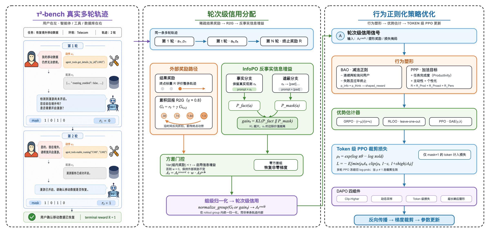

<h1 align="center">agentic-tau-rl</h1>

<p align="center">
  <b>工业级 Agentic RL 全链路 · tau²-bench 底座 · 免 SFT 冷启动 · 研究级信用分配与行为塑形 · 100% 离线可单测</b>
</p>

<p align="center">
  | <a href="技术报告.html"><b>📄 技术报告</b></a> | <a href="docs/MIGRATION.md"><b>🚀 真机迁移</b></a> | <a href="#-快速开始"><b>⚡ 快速开始</b></a> |
</p>

<p align="center">
  
  
  
  
  
</p>

---

本仓库把 **τ-bench → UserRL → BAO + InfoPO / PPP** 的研究脉络，逐层翻译成**可运行、可单测、且数值对拍论文算例**的完整 Agentic RL 实现。

<p align="center">
  
</p>

<p align="center">
  <b>算法总览（三栏）</b>：τ²-bench 真实多轮轨迹 → 轮次级信用分配（R2G 折扣前传 + InfoPO 反事实信息增益 + 方差门控）→ 行为正则化策略优化（BAO/PPP 塑形 + GRPO/RLOO/PPO + DAPO 四件套 + token 级 PPO clip loss）
</p>

与"跑通就行"的 demo 不同，这里每一个 RL 机理都用**真实 tau2 轨迹**或**手算结果**钉死正确性：reward 语义精确复刻 tau2 官方 evaluator，信用分配对拍 survey 算例，PPO / DAPO 全对拍手算。整套代码在**无 GPU 的 CPU 环境**上 2.35 秒跑完 113 个测试，同一份算法代码**零改动**即可迁移到真机训练 7B 模型。

## 🎯 项目定位

训练一个 proactive multi-turn agent，面对的不是静止环境，而是一个**活的、有意图的用户**：在 tau²-bench 这类 dual-control 客服 benchmark 里，用户由 LLM 扮演，任务达成时主动 `###STOP###`、超纲时 `###TRANSFER###`，结束权握在用户手里。这把训练目标从"最大化成功率"变成一个 **task performance ↔ user engagement 的 trade-off**。

本项目把研究深度集中堆在两处最难的地方，并给自己立了四条硬约束：

- **信用分配（credit assignment）**：稀疏的末端成功信号，如何合理摊回到中间每一轮、每个 token
- **行为塑形（behavior shaping）**：治理 agent"话太多 / 想太多"的副作用
- **四条硬约束**：① 目标 7B 量级模型 · ② **免 SFT 直接 RL** · ③ **真实 query 不合成** · ④ **100% 离线可单测**

## 🏗️ 架构

### 目录结构

```
agentic-tau-rl/
├── agentic_rl/
│   ├── env/          # 离线 tau2 环境 + reward 聚合（乘法门控，复刻官方 evaluator）
│   ├── rollout/      # 多轮 rollout loop + token-level loss masking
│   ├── credit/       # 信用分配：outcome / R2G / InfoPO 反事实信息增益
│   ├── algo/         # advantage(GRPO/RLOO/GAE) + PPO loss + DAPO 四件套
│   ├── shaping/      # 行为塑形：BAO 两条正则 / PPP 三目标
│   ├── train/        # TinyTransformer + 端到端 GRPO 训练闭环
│   └── utils/        # Sample/Trajectory/Turn 契约 · Config · fixtures 加载
├── configs/          # offline.yaml ⇄ real_qwen3_4b.yaml（同一 Config 结构）
├── fixtures/         # 5 条真实 golden 轨迹（带 gold reward_info）
├── tests/            # 11 个测试文件 · 115 用例 · 逐层对拍
├── docs/MIGRATION.md # 免 SFT 真机迁移指南
├── demo_train.py     # 端到端训练闭环演示
└── 技术报告.html      # 完整技术报告（7 章，学术论文风）
```

### 核心特性

- **🎯 三种信用分配打法并存**：outcome / R2G（UserRL 折扣前传）/ InfoPO（反事实信息增益），同一条 rollout 上可切换对比
- **🧪 每一层都可被独立证伪**：reward 逐条对拍 gold、advantage/loss 全对拍手算、token masking 逐 token 断言
- **🛡️ BAO / PPP 行为塑形**：治"连问不干活"与"过度空想提前失败"
- **⚡ 免 SFT 冷启动**：直接以已有 checkpoint 作 RL 起点，无需额外 SFT 预热
- **🔁 零算法改动迁移真机**：换四个边界组件 + 一份 YAML，`algo/`·`credit/`·`shaping/` 一字不改

## 🗺️ 技术脉络对齐

每一行既是一层论文思想，也是一个可运行子包，还挂着一条"最硬的验证"：

| survey 层 | 对齐论文 | 代码模块 | 最硬的验证 |
|---|---|---|---|
| 评测底座（dual-control 客服，用户是活的 LLM） | τ-bench / τ²-bench | `env/` | reward 聚合对拍真实 gold `reward_info` |
| 多轮 rollout + token-level loss masking | Slime example | `rollout/` | assistant=1 / obs=0 逐 token 断言 |
| 信用分配（R2G 折扣前传 / 反事实增益 / 方差门控） | UserRL / InfoPO | `credit/` | R2G 对拍 survey 第 7 轮 = 1.44；零方差组靠 info-gain 救活 |
| advantage + loss（GRPO→RLOO→PPO，DAPO 四件套） | GRPO / DAPO | `algo/` `train/` | 全对拍手算；ratio≠1 时 clip 真裁剪 |
| 行为塑形（BAO 两条正则 / PPP 三目标 + effort 解析） | BAO / PPP | `shaping/` | BAO over-thinking 对拍算例 = 4.33 |
| 端到端训练闭环 + 真机迁移 | — | `train/` `configs/` | success_logprob −6.32 → −5.11 单调上升；离线/真机同 Config |

## ⚡ 快速开始

### 环境要求

- **离线单测**：Python ≥ 3.9，仅需 CPU（`torch` + `pytest` + `pyyaml`）
- **真机训练**：Python ≥ 3.12、CUDA GPU、真实 tau2-bench（见 [docs/MIGRATION.md](docs/MIGRATION.md)）

### 安装

```bash
git clone https://github.com/<your-username>/agentic-tau-rl.git
cd agentic-tau-rl
pip install torch pytest pyyaml        # 离线单测的全部依赖
```

### 复现全部单测（CPU 秒级）

```bash
python3 -m pytest                       # 113 passed / 2 skipped，约 2.35s
```

### 跑端到端训练闭环演示

```bash
python3 demo_train.py
```

预期输出——`success_logprob` 被正 advantage 单调强化（成功轨迹在被学习）：

```
config: credit=r2g estimator=grpo gamma=0.8
step      loss   success_logprob↑   mean_reward
   0   -0.0675       -6.3159           0.500
   5   -0.0675       -5.9214           0.500
  10   -0.0675       -5.7708           0.500
  20   -0.0675       -5.4990           0.500
  29   -0.0675       -5.1066           0.500
✓ success_logprob 单调上升 = 成功轨迹被正 advantage 强化
```

## 🎮 离线 tau2 环境

离线环境结构同构于真实 tau2、reward 语义精确，覆盖三域：

| 域 | 场景 | 控制模式 | reward basis |
|---|---|---|---|
| **retail** | 订单取消 / 退款 | 单控 | `[DB, COMMUNICATE]` |
| **airline** | 改签 / 退票 | 单控 | `[DB, COMMUNICATE]` |
| **telecom** | SIM 重置 / 排障 | **dual-control** | `[ENV_ASSERTION]` |

每个环境提供：确定性 user simulator（`###STOP###` / `###TRANSFER###`）· 有状态 DB（工具有副作用）· reward 靠数据库终态断言 · 双侧工具（agent / user）。

## 📦 测试数据来源（全真实，不合成）

所有离线单测的 ground truth 是 `fixtures/` 下 **5 条真实 golden 轨迹**，取自 HuggingFace 数据集 [`Jarrodbarnes/tau2-sft-seed-v3`](https://huggingface.co/datasets/Jarrodbarnes/tau2-sft-seed-v3)（文件 `seed_sft_v3.jsonl`）。每条 fixture 的 `source` 字段记录了完整数据谱系，可逐条溯源：

| fixture | 域 | 结局 | 消息数 | gold reward | 控制模式 |
|---|---|:--:|:--:|:--:|---|
| `retail_success` | retail | 成功 | 11 | 1.0 | 单控 |
| `airline_success` | airline | 成功 | 13 | 1.0 | 单控 |
| `airline_fail` | airline | 失败 | 15 | 0.0 | 单控 |
| `telecom_success_dualctrl` | telecom | 成功 | 15 | 1.0 | **dual-control** |
| `telecom_fail_dualctrl` | telecom | 失败 | 17 | 0.0 | **dual-control** |

- **数据集**：`Jarrodbarnes/tau2-sft-seed-v3` · `seed_sft_v3.jsonl`
- **teacher_model**（生成 assistant 多轮轨迹）：`Qwen3-235B-A22B-Instruct-2507`（via together.ai）
- **user_model**（扮演模拟用户）：`gemini-2.5-flash-lite`
- 每条带 `task_id` / `tau2_task_id`，对应真实 tau2 任务编号（如 retail 任务 50）

每条 fixture 的结构：`messages`（system/user/assistant，assistant 内嵌 `<tool_call>` 块，工具结果以 `Tool result for ...` 回填于 user 轮）+ `gold`（`reward` / `success` / `reward_info`，含 `db_check` / `env_assertions` / `action_checks` / `reward_basis`）。

> 💡 这 5 条 fixture 是**离线单测的 ground truth**（钉死 reward 语义、类型系统、masking）；而 `demo_train.py` 端到端跑 GRPO 用的是 `ScriptedPolicy` 在 mock `TauEnv` 上**现场生成**的轨迹，两者分工不同。核心验证（`test_08`）通过"重放真实轨迹 → 我们算的 reward == tau2 官方 gold reward"逐条对拍——因为 fixture 就是真实 tau2 的输出，这等价于一次与官方 evaluator 的交叉验证。

## 🔬 信用分配：三种打法

多轮 agent 的核心难题——成功信号只在末尾出现一个，功劳却可能来自早先某个澄清轮。本项目实现三条路径，切换只改 `config.credit.method` 一个字段：

**1. outcome（朴素）** — 只用最终奖励，中间轮全 0。

**2. R2G（UserRL 折扣前传）** — `R2G_t = r_t + γ·R2G_{t+1}`，把终点成功奖励沿时间倒着折扣分给铺路的每一步（γ=0.8，对拍 survey TravelGym 算例第 7 轮 = 1.44）。

**3. InfoPO（反事实信息增益）** — `gain_t = KL(P_factual ‖ P_masked)`，拿掉某轮反馈看 agent 下一步决策分布变多少。**零方差组**（GRPO advantage≈0、学不动）靠 info-gain 顶上来当训练信号被救活——这正是 InfoPO 的主战场。

## 🏋️ 优化算法与行为塑形

**Advantage estimators**：GRPO（组内标准化 `(r-μ)/σ`）· RLOO（leave-one-out）· PPO+GAE。

**DAPO 四件套**（逐件可开关，单测隔离验证）：
- ① Clip-Higher（`ε_high > ε_low`，鼓励低概率 token 探索）
- ② Dynamic Sampling（丢弃零方差组）
- ③ Token-Level Loss（长序列每 token 等权）
- ④ Overlong Reward Shaping（软惩罚过长响应）

**行为塑形**：
- **BAO（减法）**：① Information-Seeking——连问两轮用户罚 `-λ_ans`；② Over-Thinking——失败且提前终止罚 `-λ_think·(T-T')/T'`（对拍算例 4.33）
- **PPP（加法）**：`R = R_Prod + R_Proact + R_Pers`，`[Cost N]` → effort 解析

> ⚠️ **诚实边界**：BAO 的 `λ_ans` / `λ_think` / `w` 论文未公开数值，代码用占位默认（0.1），公式与思想严格对齐，真机需自行调参。

## 🧪 测试全景

| 测试文件 | 用例 | 验证内容 | 状态 |
|---|:--:|---|:--:|
| `test_00_fixtures_and_types` | 8 | golden fixture 完整性 + 类型拍平 masking | ✅ |
| `test_01_env` | 10 | reward 聚合对拍 gold + dual-control 可解 | ✅ |
| `test_02_rollout_masking` | 11 | 多轮 rollout + token masking（assistant=1/obs=0） | ✅ |
| `test_03_algo` | 20 | GRPO/RLOO/GAE/PPO-clip/DAPO 全对拍手算 | ✅ |
| `test_04_credit` | 17 | R2G 对拍 1.44 + 反事实 KL + 方差门控 | ✅ |
| `test_05_shaping` | 14 | BAO 对拍 4.33 + PPP 三目标 + clip 语义 | ✅ |
| `test_06_train_e2e` | 10 | tiny model 真跑 GRPO，logprob 上升 | ✅ |
| `test_07_infopo_train` | 7 | 零方差组靠 info-gain 救活 | ✅ |
| `test_08_tau2_integration` | 5 | 全 fixture 交叉验证 + 真 tau2 skipif | ✅ 3 / ⏭ 2 |
| `test_09_hardening` | 9 | 多步 PPO（ratio≠1）+ ref-KL + effort 解析 | ✅ |
| `test_10_config` | 4 | 离线/真机 YAML 同 Config 结构 | ✅ |

**合计**：115 用例（113 passed + 2 skipped），CPU 2.35s 跑完。2 个 skip 因 tau2 需 Python≥3.12，离线环境用 mock env + 真实 gold `reward_info` 交叉验证（最强离线证明）。

## 🚀 通往真机：免 SFT，零算法改动

替换四个边界组件 + 换一份 YAML 即可上真机，`algo/` `credit/` `shaping/` 逻辑**一字不改**：

| 离线（单测） | → | 真机 | 替换文件 |
|---|:--:|---|---|
| `TinyTransformer` | → | Qwen3-4B (HF) | `train/model.py` |
| `ScriptedPolicy` | → | `HFPolicy` | `rollout/hf_policy.py` |
| `TauEnv` (mock) | → | `RealTau2Env` | `env/tau2_adapter.py` |
| `ByteTokenizer` | → | Qwen3 tokenizer | `load_hf_tokenizer` |

**不变的**：`rollout()` · `train_step()` · `multi_step_ppo_update()` · 所有 `algo/` `credit/` `shaping/` 模块——它们只依赖 `Sample` / `Trajectory` 契约，与后端无关。

**复现路线**：① R2G+GRPO baseline → ② 叠 DAPO 四件套 → ③ BAO 治副作用 → ④ InfoPO / PPP 可选。详见 [docs/MIGRATION.md](docs/MIGRATION.md)。

## 📖 参考工作

本项目对齐的研究脉络：

- **τ-bench** — Yao et al. *τ-bench: A Benchmark for Tool-Agent-User Interaction in Real-World Domains.* 2024.
- **τ²-bench** — Barres et al. *τ²-bench: Evaluating Conversational Agents in a Dual-Control Environment.* 2025.
- **UserRL** — Qian et al. *UserRL: Training Interactive User-Centric Agents via Reinforcement Learning.* 2025. ([arXiv:2509.19736](https://arxiv.org/abs/2509.19736))
- **BAO** — *Pushing Forward Pareto Frontiers of Proactive Agents with Behavioral Agentic Optimization.* 2026.
- **GRPO** — Shao et al. *DeepSeekMath.* 2024. · **DAPO** — Yu et al. 2025. · **RLOO** — Ahmadian et al. 2024.
- **PPO / GAE** — Schulman et al. 2017 / 2016.

## 🙏 致谢

- [tau2-bench](https://github.com/sierra-research/tau2-bench) — Sierra Research 的 dual-control 客服评测底座
- [UserRL](https://github.com/SalesforceAIResearch/UserRL) — 多轮信用分配研究脉络的重要参考

## 📄 License

MIT License. 详见 [LICENSE](LICENSE)。
