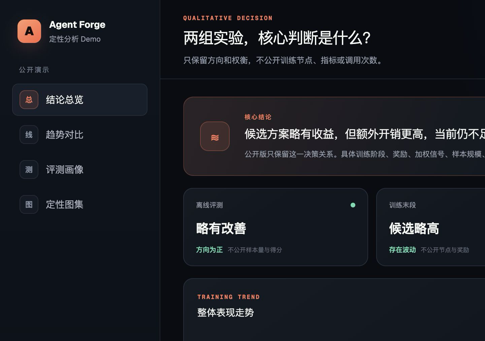

# Agentic RL 入门

又是小red帮学妹找基座实习的一天。

我目前在美团M17做基座agent后训练，24年上交EE毕业转AI，帮助像曾经的我一样想转行的朋友！

欢迎关注我的小红书：[小red](https://xhslink.com/m/2dKOxmxjYcC)，后续会继续更新 Agentic RL、基座模型后训练和算法工程师转行相关内容。

## ⭐ Agent Forge：Agent / RL 实验可视化看板

这是本仓库重点推荐的可视化项目：把两组 Agent / RL 实验的训练趋势、离线评测、工具调用成本和证据强度放进同一个交互式看板。

**[进入可视化项目](./agent-training-cockpit/)** · **[查看完整使用说明](./agent-training-cockpit/docs/USAGE.md)** · **[下载数据模板](./agent-training-cockpit/data/experiment.example.json)**

[](./agent-training-cockpit/)

## 在线阅读

- [在线入口页](https://xiaored5.github.io/Agentic-RL-Most-Detailed-Intro/)
- [Agentic RL入门1：基础、代码](https://xiaored5.github.io/Agentic-RL-Most-Detailed-Intro/Agentic%20RL%E5%85%A5%E9%97%A81%EF%BC%9A%E5%9F%BA%E7%A1%80%E3%80%81%E4%BB%A3%E7%A0%81.html)
- [Agentic RL入门2：信用分配](https://xiaored5.github.io/Agentic-RL-Most-Detailed-Intro/Agentic%20RL%E5%85%A5%E9%97%A82%EF%BC%9A%E4%BF%A1%E7%94%A8%E5%88%86%E9%85%8D.html)
- [Agentic RL入门3：transformer 架构](https://xiaored5.github.io/Agentic-RL-Most-Detailed-Intro/Agentic%20RL%E5%85%A5%E9%97%A83%EF%BC%9Atransformer%E6%9E%B6%E6%9E%84.html)
- [Agentic RL入门4：Credit 错分与算法接口](https://xiaored5.github.io/Agentic-RL-Most-Detailed-Intro/Agentic%20RL%E5%85%A5%E9%97%A84%EF%BC%9ACredit%20%E9%94%99%E5%88%86%E4%B8%8E%E7%AE%97%E6%B3%95%E6%8E%A5%E5%8F%A3.html)
- [Agentic RL入门5：Skill-based Agentic RL](https://xiaored5.github.io/Agentic-RL-Most-Detailed-Intro/Agentic%20RL%E5%85%A5%E9%97%A85%EF%BC%9ASkill-based%20Agentic%20RL.html)
- [Agentic RL入门6：多轮工具调用](https://xiaored5.github.io/Agentic-RL-Most-Detailed-Intro/Agentic%20RL%E5%85%A5%E9%97%A86%EF%BC%9A%E5%A4%9A%E8%BD%AE%E5%B7%A5%E5%85%B7%E8%B0%83%E7%94%A8.html)
- [如何在 5 万张国产芯片训练出 1.6T 万亿参数模型？](https://xiaored5.github.io/Agentic-RL-Most-Detailed-Intro/longcat-2.0/如何在%205%20万张国产芯片训练出%201.6T%20万亿参数模型？.html)
- [GLM-5.2 长程任务的 RL 怎么做？](https://xiaored5.github.io/Agentic-RL-Most-Detailed-Intro/glm-5.2-longhorizon-rl/GLM-5.2%20%E9%95%BF%E7%A8%8B%E4%BB%BB%E5%8A%A1%E7%9A%84%20RL%20%E6%80%8E%E4%B9%88%E5%81%9A%EF%BC%9F.html)
- [Kimi-K3 为什么这么强？](https://xiaored5.github.io/Agentic-RL-Most-Detailed-Intro/Kimi-K3/Kimi-K3%20%E4%B8%BA%E4%BB%80%E4%B9%88%E8%BF%99%E4%B9%88%E5%BC%BA%EF%BC%9F.html)

## 本地预览

```bash
python3 -m http.server 8000
```

然后访问：

```text
http://localhost:8000
```
