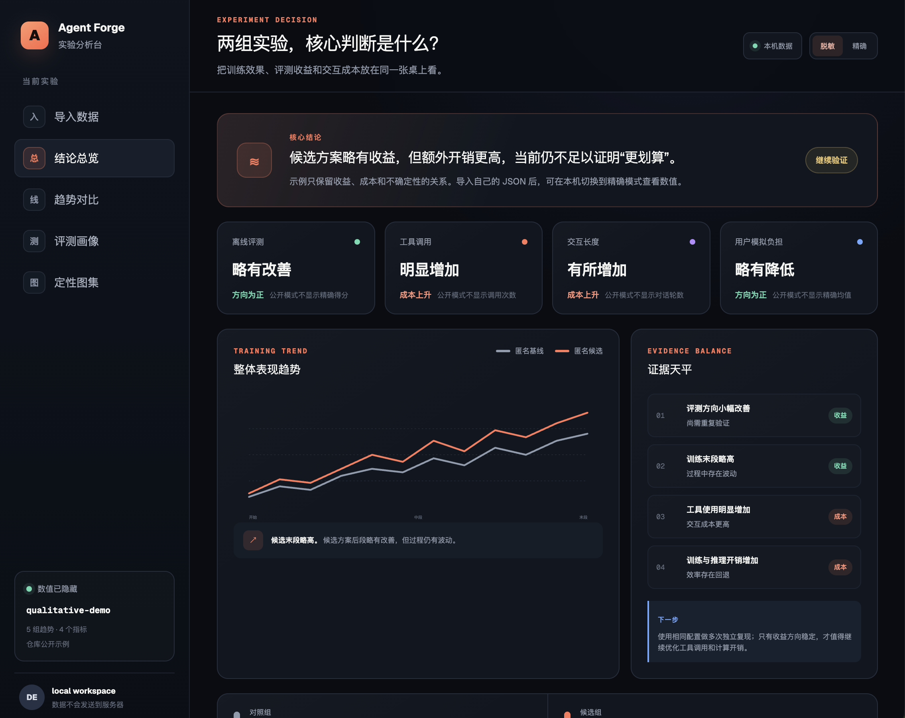
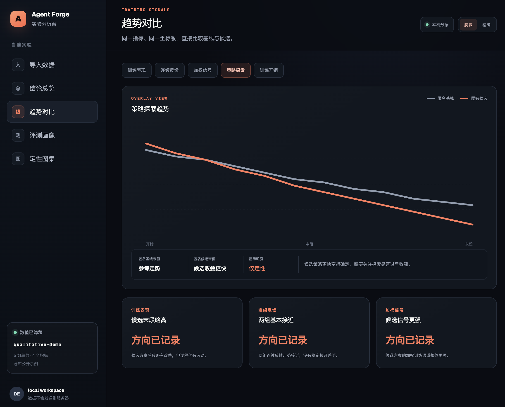
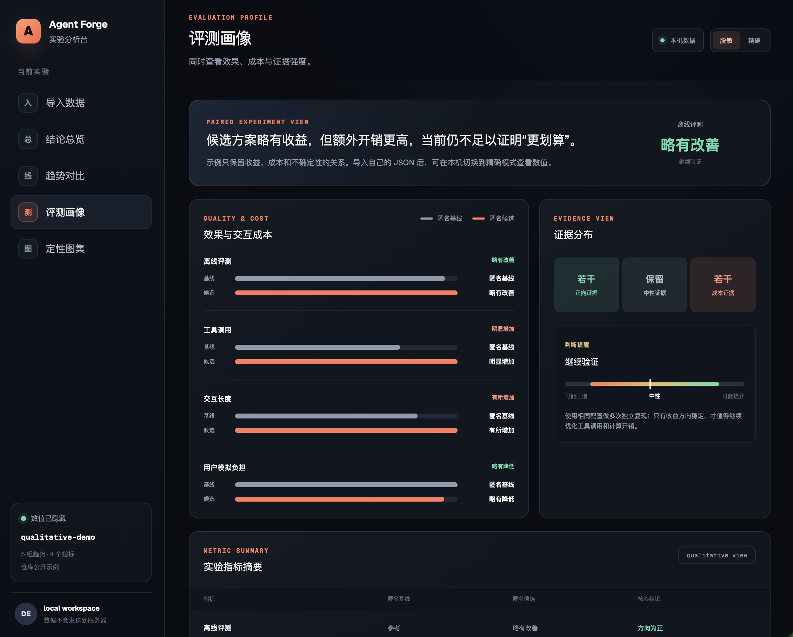
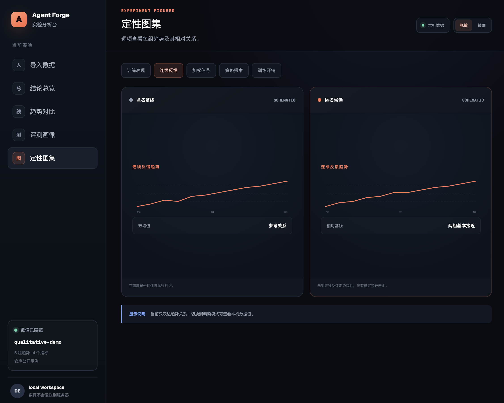

# Agent Forge

一个用于比较两次 Agent / RL 训练实验的交互式看板 Demo。用户可以直接导入自己的 JSON 数据，不需要修改页面代码。

看板把定性趋势、评测方向和交互成本放在一起，帮助回答：

- 候选实验是否真的优于基线？
- 成功率提升是否伴随着更多工具调用和对话轮数？
- 单次结果是否足以支持发布决策？
- 如何在不公开具体指标的前提下说明实验结论？

## 使用自己的数据

### 最简单的方式：浏览器导入

```bash
npm install
npm run dev
```

打开 [http://localhost:3000](http://localhost:3000)，进入左侧“导入数据”：

1. 点击“下载 JSON 模板”；
2. 用自己的基线与候选实验替换模板内容；
3. 点击“选择本地 JSON”；
4. 导入成功后，在右上角选择“脱敏”或“精确”模式。

导入的数据只在当前浏览器读取并保存，不会发送到服务器。完整字段说明、示例和隐私提醒见 [docs/USAGE.md](docs/USAGE.md)。

### 导入前校验

```bash
npm run data:validate -- /你的路径/experiment.json
```

模板位于 [`data/experiment.example.json`](data/experiment.example.json)，支持：

- `metrics`：成功率、平均工具调用、平均轮数、耗时等汇总指标；
- `trends`：Reward、Advantage、熵、训练耗时等序列；
- `evidence`：支持收益、成本或中性判断的证据；
- `qualitative / exact`：脱敏展示与精确展示之间切换。

## 数据与隐私

仓库自带的数据只用于公开演示：

- 真实实验 ID、内部任务名和本地路径已删除。
- 示例指标和曲线是合成、归一化数据，不对应任何真实实验。
- 默认使用“脱敏”模式，只表达“略有收益、成本增加、结论仍不确定”。
- 不包含用户提示词、模型回答、工具参数、逐条轨迹或原始 eval JSONL。
- 用户导入的数据保存在浏览器本地存储中；点击“恢复公开示例”可以清除。
- 公开示例不可用于科学复现或业务决策。

## 界面预览

### 结论总览



### 趋势对比



### 评测画像



### 定性图集



## 本地运行

需要 Node.js `>=22.13.0`。

```bash
npm install
npm run dev
```

打开 [http://localhost:3000](http://localhost:3000)。

## 验证

```bash
npm run build
npm run lint
```

## 主要文件

- `app/page.tsx`：看板页面与交互逻辑。
- `app/experiment-data.ts`：数据类型、校验和安全限制。
- `app/globals.css`：视觉样式和响应式布局。
- `data/experiment.example.json`：可下载、可修改的数据模板。
- `scripts/validate-experiment.mjs`：导入前的格式校验脚本。
- `docs/USAGE.md`：完整使用说明。
- `docs/screenshots/`：不含具体数值的界面预览。
