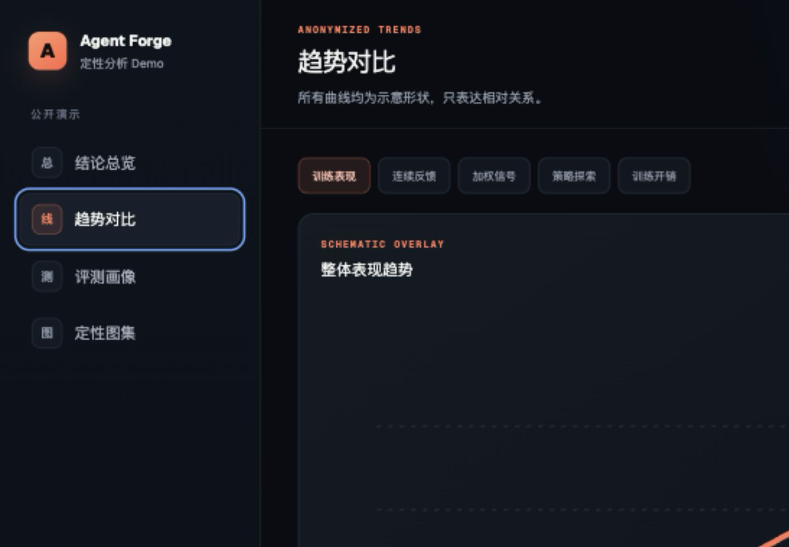
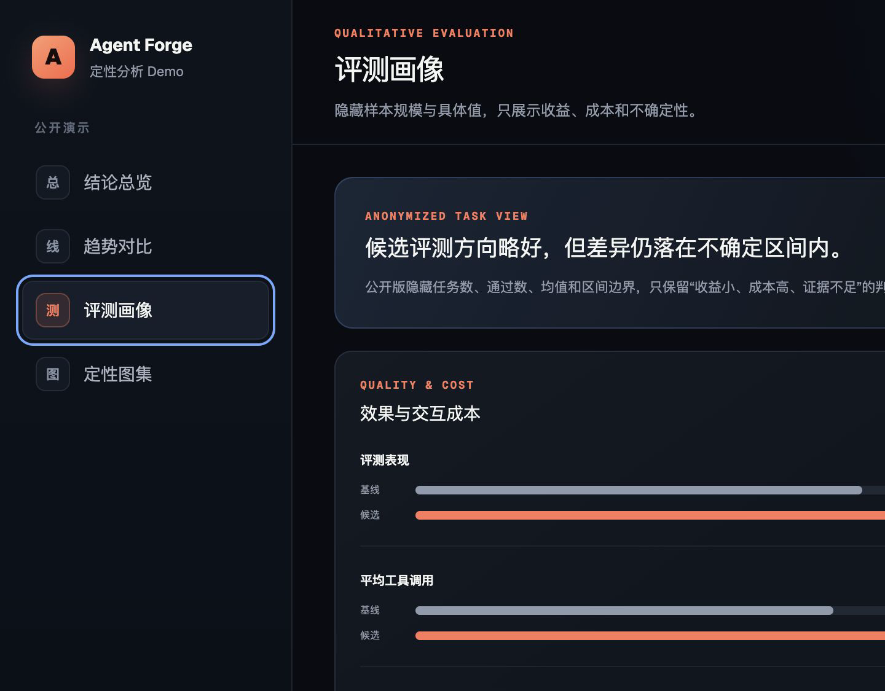

# Agent Training Cockpit Demo

一个用于比较两次 Agent / RL 训练实验的交互式看板 Demo。

看板把定性趋势、评测方向和交互成本放在一起，帮助回答：

- 候选实验是否真的优于基线？
- 成功率提升是否伴随着更多工具调用和对话轮数？
- 单次结果是否足以支持发布决策？
- 如何在不公开具体指标的前提下说明实验结论？

## 数据与隐私

仓库只包含定性的公开演示内容：

- 真实实验 ID、内部任务名和本地路径已删除。
- 不包含训练节点、奖励、加权信号、成功率、样本量、工具调用、轮数或耗时的具体值。
- 不包含指标 JSON、数值数组或带刻度的实验图。
- 页面曲线是人工示意形状，只表达“略有收益、成本增加、结论仍不确定”。
- 不包含用户提示词、模型回答、工具参数、逐条轨迹或原始 eval JSONL。
- 本 Demo 不可用于科学复现或业务决策。

## 界面预览

### 结论总览


### 趋势对比



### 评测画像



### 定性图集


## 本地运行

需要 Node.js `>=22.13.0`。

```bash
npm install
npm run dev
```

打开 [http://localhost:3000](http://localhost:3000)。

## 验证

```bash
npm run build
npm run lint
```

## 主要文件

- `app/page.tsx`：看板页面与交互逻辑。
- `app/globals.css`：视觉样式和响应式布局。
- `docs/screenshots/`：不含具体数值的界面预览。
