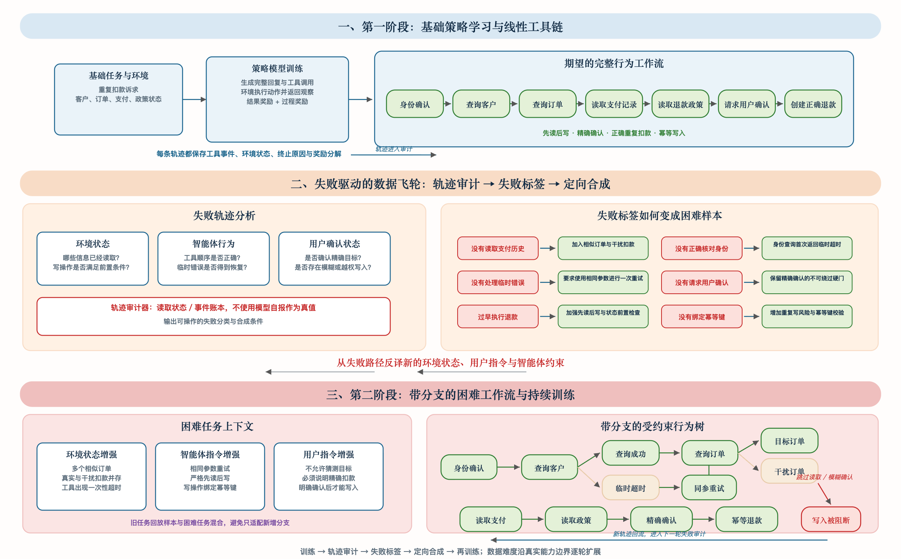

# AgenticQwen Long-Horizon Curriculum：可审计完整复现报告

> ✅ **结论先行。** 本次运行在 `NVIDIA RTX PRO 6000 Blackwell Server Edition` 上完成了 Qwen3-8B 的两阶段 response-token QLoRA-GRPO：Stage 1 产生真实失败与非零奖励方差，训练后 probe 达到满分时按 frontier taxonomy 升级难度并混入 replay，再从 Stage-1 adapter 继续 Stage 2。完整性审计为 **PASS**，官方 BFCL-V4 multi-turn smoke 为 **NOT_RUN**。这证明的是一条真实、可恢复、可复核的小规模 curriculum 链路；不等价于论文 100K 数据、八卡训练或 47.4 平均分。

**Run:** `qwen3-8b-qlora-20260804-v2`  
**模型:** `Qwen/Qwen3-8B` · NF4 QLoRA rank 16  
**训练:** Stage 1 `12` steps → Stage 2 `12` steps  
**状态:** curriculum 完整通过 · BFCL `NOT_RUN` · paper-scale claim `false`

## 1. 这次到底复现了什么

这不是“写好一个框架”或“调用一次 API”的展示。训练过程中，Qwen3-8B 自己生成 assistant response token 和结构化工具调用；TRL 为每条 rollout 创建独立的 stateful environment；工具执行后把 observation 继续写回对话；episode 结束时由环境最终状态计算 outcome/process reward；四条同 prompt rollout 形成 GRPO group 并反向传播到 LoRA 参数。

第二阶段的数据不是一份与运行无关的固定训练集。训练完成后先运行冻结 probe：若仍有 terminal failure，就按实际失败类型生成难例；若小 probe 已全对，就转入预定义的 frontier taxonomy，继续增加 decoy orders、瞬时失败和更紧的确认约束。两条路径都会保存 source trace hash，并混入旧任务 replay 再训练。本次实际走的是 `frontier_taxonomy_fallback`。

| 层次 | 本次真实证据 | 不能据此声称 |
|---|---|---|
| 多轮 policy | Qwen3-8B response tokens + native tool calls | 不是单 token 四选一 |
| Environment | 身份、订单、支付、政策、确认、退款状态机 | 不是模型自报“成功” |
| RL update | 两阶段 optimizer steps、adapter hash、checkpoint | 不是只做 inference |
| Curriculum | Stage-1 trace hash → failure/frontier selection → hard tasks → Stage 2 | 当前选择：`frontier_taxonomy_fallback` |
| Evaluation | untouched final holdout + fresh reload | BFCL smoke 当前为 `NOT_RUN` |

## 2. 从论文目标拆成 Plan → Execute → Verify

### Plan

1. 锁定 final holdout，再生成训练数据，阻断 task-ID 泄漏。
2. Stage 1 只训练基础安全退款任务；probe 专门暴露 decoy 与工具失败。
3. 失败诊断只读环境 state/event ledger，不让 LLM 充当 ground truth。
4. Stage 2 从原 adapter 继续训练，混入 replay 避免只适配难例。
5. 独立进程重载 adapter；最后再进入官方 BFCL evaluator。

### Execute

```text
Stage-1 train (8 tasks, group=4)
    ↓
Frozen probe rollouts (4 tasks)
    ↓
Failure taxonomy / frontier fallback + trace SHA-256
    ↓
Hard synthesis (8 tasks) + replay (4 tasks)
    ↓
Stage-2 continue training
    ↓
Untouched holdout (6 tasks)
    ↓
Fresh-process reload
    ↓
BFCL base/adapter smoke（本次状态：NOT_RUN）
```

### 一张图看懂几个 Stage 如何串起来

下面这张图把基础工具链、失败轨迹审计、困难数据合成和第二阶段持续训练放在同一条因果链上。第一阶段学习线性的完整工具链；中间不是“随机加噪”，而是把失败类型映射为相似干扰项、临时超时、同参重试、确认硬门、先读后写和幂等校验；第二阶段把这些压力组合成带分支的受约束工作流，并让新轨迹继续回流。



> 图中 failure taxonomy 是可操作的课程标签；本次微型 run 的实际 source selection 记录为 `frontier_taxonomy_fallback`，具体 trace、任务和 SHA-256 见 `stage2/synthesis_manifest.json`。

### Verify

| 审计门 | 状态 | 证据 |
|---|---|---|
| stage1 adapter exists | **PASS** | `/root/autodl-tmp/runs/agenticqwen-qwen3-8b-qlora-v2/qwen3-8b-qlora-20260804-v2/stage1/adapter` |
| stage2 adapter exists | **PASS** | `/root/autodl-tmp/runs/agenticqwen-qwen3-8b-qlora-v2/qwen3-8b-qlora-20260804-v2/stage2/adapter` |
| stage2 adapter differs from stage1 | **PASS** | `stage1=7d3c6d223209f26f26e39004c46afac8e6f123ed30992f8a97bc56f7c275bee0; stage2=920f76c8c0f35d8976ddf4a24ac77ae4fbcc5cd793ac942865942b01d9149c4d` |
| both GRPO stages changed trainable parameters | **PASS** | `stage1=True; stage2=True` |
| training reward variance observed | **PASS** | `stage1_std=0.5267711867027023; stage2_std=0.2673004453755907` |
| final holdout isolation | **PASS** | `overlap=[]` |
| failure-driven synthesis has provenance | **PASS** | `deterministic_failure_driven_curriculum` |
| stage2 consumed stage1 adapter | **PASS** | `7d3c6d223209f26f26e39004c46afac8e6f123ed30992f8a97bc56f7c275bee0` |
| all planned optimizer steps completed | **PASS** | `stage1=12/12; stage2=12/12` |
| evaluation traces contain complete episode sets | **PASS** | `stage1_probe=4; stage2_holdout=6` |
| fresh-process adapter replay | **PASS** | `episodes=6; success_rate=1.0; parent_pid=5643; child_pid=6913` |

## 3. Stateful tool environment

环境有七个公开工具：`request_identity`、`lookup_customer`、`list_orders`、`get_payment_history`、`get_refund_policy`、`request_confirmation`、`create_refund`。它们不是一串无状态 mock：每一步读取或改变 episode state，后续工具会检查先决条件。

写操作 `create_refund` 只有在以下条件同时成立时才通过：身份已验证、订单已读、支付历史已读、政策已读、用户对精确 order/charge/amount 明确确认、目标是 duplicate charge、金额精确、reason 合法、idempotency key 合法。模型无法绕过代码直接修改 state。

奖励为：

$$R = \mathbb{1}[\text{exact refund success}] + 0.30 \cdot R_{process}$$

`R_process` 奖励正确读取链、从 transient error 中恢复、任务绑定的幂等键、精确退款理由与参数简洁度；惩罚 premature write、schema error、重复调用与超出预期的工具步数。V1 把所有成功轨迹裁成同一个 `1.3`，导致 advantage 为零；V2 保留成功轨迹之间的可解释质量差异。

## 4. 真正的 response-token GRPO

每个 prompt 采样 $G=4$ 条完整轨迹。第 $i$ 条轨迹的 group-relative advantage 为：

$$A_i = \frac{R_i - \mu(R_1,\ldots,R_G)}{\sigma(R_1,\ldots,R_G)+10^{-4}}$$

优化使用 DAPO-style clipped objective；loss mask 只覆盖 assistant completion tokens，tool observations 与 prompt 不参与梯度。LoRA 覆盖 Q/K/V/O 与 gate/up/down projections，base 权重以 NF4 4-bit 加载，计算使用 bfloat16。

| 超参数 | 值 |
|---|---:|
| Group size | 4 |
| Gradient accumulation | 4 |
| Max completion | 1400 tokens |
| Max tool iterations | 10 |
| Stage-1 LR / steps | 5e-06 / 12 |
| Stage-2 LR / steps | 3e-06 / 12 |
| Loss | `dapo` |

## 5. Stage 1：先训练，再诚实看失败

| 指标 | Before | After | Δ |
|---|---:|---:|---:|
| Probe success rate | 75.0% | 100.0% | +25.0 pt |
| Mean combined reward | 0.9041 | 1.2502 | +0.3461 |
| Optimizer global step | — | 12 | — |
| Training seconds | — | 408.934 | — |
| Training rollout reward std | — | 0.5268 | 27 unique rewards |
| Trainable parameters changed | — | `True` | train loss `0.029398` |

| 失败类型 | Before | After |
|---|---:|---:|
| `POLICY_NOT_INSPECTED` | 1 | 0 |

这里不因为“训练跑完”就自动写成进步。如果 success rate 或 mean reward 下降，报告仍保留负号；curriculum 的价值要由 Stage-2 unseen holdout 与 failure composition 判断，而不是挑一条漂亮轨迹。

### Stage-1 probe 代表轨迹

任务 `refund-curriculum_probe-0100`；成功：`True`；失败分类：`SUCCESS`；combined reward：`1.243`。

| Turn | Tool | OK | Observation / state evidence |
|---:|---|:---:|---|
| 1 | `request_identity` | ✅ | `{"email": "customer0100@example.com", "phone_last4": "8521"}` |
| 2 | `lookup_customer` | ✅ | `{"customer_id": "CUS-1100", "verified": true}` |
| 3 | `list_orders` | ✅ | `{"orders": [{"amount": 349.0, "currency": "CNY", "order_id": "ORD-2026-4100"}, {"amount": 478.13, "currency": "CNY", "order_id": "ORD-DECOY-100-A"}]}` |
| 4 | `get_payment_history` | ✅ | `{"charges": [{"amount": 349.0, "captured_at": "2026-07-25T09:31:08+08:00", "charge_id": "CHG-7200", "currency": "CNY", "duplicate": false}, {"amount": 349.0, "captured_at": "202…` |
| 5 | `get_refund_policy` | ✅ | `{"arrival_window": "3-5 business days", "currency": "CNY", "eligible": true, "max_refund": 349.0, "requires_confirmation": true, "target": "duplicate charge only"}` |
| 6 | `request_confirmation` | ✅ | `{"confirmed": true, "user_message": "I confirm refunding only CHG-7201 for CNY 349.00."}` |
| 7 | `create_refund` | ✅ | `{"amount": 349.0, "arrival_window": "3-5 business days", "currency": "CNY", "refund_id": "RF-55B751695E"}` |

## 6. 失败驱动的困难数据合成

困难数据 manifest 记录 source trace 的绝对路径与 SHA-256：`ca0d54b78a400bab1de423e0bf2efc8cd1d68819925e926d16e2389c6d42b7bd`。本次 source selection 为 `frontier_taxonomy_fallback`。当 post-train probe 仍有失败时优先按残余失败合成；若小 probe 已全对，则升级到预定义 frontier taxonomy。生成器不把模型自然语言当答案，所有 customer/order/charge/amount、状态转移与 verifier target 都由代码确定。

| 合成项 | 证据 |
|---|---|
| Generator | `deterministic_failure_driven_curriculum` |
| Source selection | `frontier_taxonomy_fallback` |
| Hard tasks | 8 |
| Replay task IDs | `refund-stage1_train-0000, refund-stage1_train-0001, refund-stage1_train-0002, refund-stage1_train-0003` |
| Stage-2 train SHA-256 | `5790304c792b7ef6bbcdf85b9eb2e40eb5f4ffd1ab2767c6e0007d085a96bf1d` |
| Ground-truth policy | All identifiers, amounts, transitions, and verifier targets are generated deterministically from code; no model output is used as ground truth. |

任务增强规则把 failure 转成可训练扰动：未读支付历史 → 增加第三个 decoy；policy failure → policy service 首次 timeout；identity failure → lookup 首次 timeout；loop/tool-error → 在读链或 write 上加入一次 retryable failure；confirmation missing → 保留精确确认硬门。

## 7. Stage 2：从同一个 adapter 继续训练

| 指标 | Before | After | Δ |
|---|---:|---:|---:|
| Final-holdout success rate | 66.7% | 100.0% | +33.3 pt |
| Mean combined reward | 0.8376 | 1.2505 | +0.4128 |
| Optimizer global step | — | 12 | — |
| Training seconds | — | 396.218 | — |
| Training rollout reward std | — | 0.2673 | 33 unique rewards |
| Trainable parameters changed | — | `True` | train loss `-0.029555` |

| 失败类型 | Before | After |
|---|---:|---:|
| `IDENTITY_ERROR` | 2 | 0 |

Stage-2 summary 中的 `input_adapter_weights_sha256` 必须等于 Stage-1 `adapter_model.safetensors` hash；Stage-2 权重 hash 又必须不同。这两个条件分别排除“第二阶段从 base 重开”和“第二阶段根本没有更新”。

### Final holdout 代表轨迹

任务 `refund-final_holdout-0204`；成功：`True`；失败分类：`SUCCESS`；combined reward：`1.248`。

| Turn | Tool | OK | Observation / state evidence |
|---:|---|:---:|---|
| 1 | `request_identity` | ✅ | `{"email": "customer0204@example.com", "phone_last4": "2369"}` |
| 2 | `lookup_customer` | ✅ | `{"customer_id": "CUS-1204", "verified": true}` |
| 3 | `list_orders` | ✅ | `{"orders": [{"amount": 349.0, "currency": "CNY", "order_id": "ORD-2026-4204"}, {"amount": 478.13, "currency": "CNY", "order_id": "ORD-DECOY-204-A"}, {"amount": 478.13, "currency…` |
| 4 | `get_payment_history` | ✅ | `{"charges": [{"amount": 349.0, "captured_at": "2026-07-25T09:31:08+08:00", "charge_id": "CHG-7408", "currency": "CNY", "duplicate": false}, {"amount": 349.0, "captured_at": "202…` |
| 5 | `get_refund_policy` | ✅ | `{"arrival_window": "3-5 business days", "currency": "CNY", "eligible": true, "max_refund": 349.0, "requires_confirmation": true, "target": "duplicate charge only"}` |
| 6 | `request_confirmation` | ✅ | `{"confirmed": true, "user_message": "I confirm refunding only CHG-7409 for CNY 349.00."}` |
| 7 | `create_refund` | ✅ | `{"amount": 349.0, "arrival_window": "3-5 business days", "currency": "CNY", "refund_id": "RF-27582FA0BC"}` |

## 8. 独立评测：fresh reload 已完成，官方 BFCL-V4 未运行

已完成的独立性来自 fresh-process reload：父训练进程释放模型后启动新的 Python 子进程，记录父/子 PID，再重新加载 base + Stage-2 PEFT adapter，在未触碰的 final holdout 上重新生成并计分。官方 BFCL-V4 multi-turn evaluator 的 base/adapter 对照路径已经实现，但本次没有运行，所以没有 result JSON、score CSV 或 benchmark 分数可报告。

| Fresh replay evidence | 值 |
|---|---|
| Parent PID | `5643` |
| Child PID | `6913` |
| Is fresh process | `True` |
| Episodes | `6` |

| Variant | 状态 | Episodes | Official score |
|---|---|---:|---|
| — | **NOT_RUN** | 0 | BFCL artifact missing |

BFCL 状态为 `NOT_RUN`。只有在 manifest、result JSON 和 score CSV 齐全后，才可声称官方接口、tool-call 格式、multi-turn execution 与 score pipeline 跑通；即便未来完成小样本 smoke，也不能替代每类 200 个任务的论文 profile，更不能与论文平均分直接比较。

## 9. 实验完整性与可恢复性

- 数据先落盘再训练；train/probe/final-holdout ID 分离并写入 manifest。
- 每个 JSONL trace 同时记录 task hash、stage、failure type、reward 与完整 event ledger。
- Trainer 每半程保存 checkpoint；远程中断后从最大 `checkpoint-N` 恢复，旧 trace 不清空。
- 已完成的 stage 只有在 summary 状态和 adapter 目录同时存在时才跳过。
- 模型缓存、checkpoint、adapter、benchmark 与报告源分别持久化；下载后再次计算 SHA-256。
- 日志写入前扫描疑似 `sk-` secret；API key 永远不进入 artifact。

| Artifact | Bytes | SHA-256 |
|---|---:|---|
| `data_manifest.json` | 1683 | `974ff3207c953dae…` |
| `fresh_replay/summary.json` | 1740 | `2b9cec2aa8d206f5…` |
| `fresh_replay/traces.jsonl` | 23769 | `77e47ef0b181b9b3…` |
| `launch.json` | 209 | `81361460b3a078c9…` |
| `model_snapshot_manifest.json` | 2753 | `da9d9484e5c83ae3…` |
| `preflight.json` | 2160 | `7cb37aa7a6a542e3…` |
| `process-exit.json` | 74 | `030d8c25cde9ead2…` |
| `resolved_config.json` | 1940 | `ee814212f548ae3d…` |
| `run_summary.json` | 24388 | `90c2258cc7491e9e…` |
| `stage1/eval_before_traces.jsonl` | 14764 | `653b7653ed38aebd…` |
| `stage1/eval_probe_traces.jsonl` | 14549 | `ca0d54b78a400bab…` |
| `stage1/summary.json` | 6370 | `c9b8566fc869144a…` |
| `stage1/train_traces.jsonl` | 183657 | `73e03318e92807d9…` |
| `stage2/eval_before_traces.jsonl` | 17954 | `29b3bef16865f1b5…` |
| `stage2/eval_final_traces.jsonl` | 23763 | `05b1c350702ea68c…` |
| `stage2/summary.json` | 6928 | `9bd2ba39556d1351…` |
| `stage2/synthesis_manifest.json` | 2476 | `ea218e668bea780b…` |
| `stage2/train_traces.jsonl` | 199747 | `c555a2d9f57746f2…` |
| `tasks/curriculum_probe.jsonl` | 2695 | `64c90346b92cf943…` |
| `tasks/final_holdout.jsonl` | 4145 | `dc9c2fc8139dc7d8…` |
| `tasks/stage1_train.jsonl` | 5510 | `afa55e2f00091ab1…` |
| `tasks/stage2_hard.jsonl` | 6232 | `77a8e8484cd7b65a…` |
| `tasks/stage2_train.jsonl` | 8987 | `5790304c792b7ef6…` |
| `verification.json` | 4708 | `b623e4944131ffd7…` |

## 10. 失败模式：项目为什么可能“训练了却没学会”

### Group saturation

如果同一 group 四条 rollout 都成功或都失败，标准差接近零，relative advantage 变成零。过程奖励只能在轨迹真正产生不同读取/恢复行为时打破平局；若所有样本在第一个 token 就走同一路径，仍然没有信号。

### Reward hacking

模型可能反复调用读工具累积 progress。环境因此对 redundant call 和超过十步的序列施加惩罚，并且 outcome success 仍要求精确写状态；只刷过程分无法得到完整奖励。

### Curriculum forgetting

只训练难例会破坏基础路径，因此 Stage 2 固定加入四个 Stage-1 replay tasks。更完整的实验应增加 replay ratio 消融与至少三 seeds；本次单次预算运行不能支持“普遍优于”的统计主张。

### Benchmark mismatch

自建退款环境验证 causal curriculum，但 BFCL 测工具调用格式、缺函数/缺参数和长上下文；TAU-2 又依赖 user simulator。不同指标回答不同问题，不能用自建 success rate 替换官方 benchmark。

## 11. 一键复现与运行成本

```bash
# AutoDL 实例中：复用 /root/autodl-tmp/models/Qwen3-8B
./run_curriculum_autodl_remote.sh

# 本地：把下载的 run root 渲染成 HTML + PPT
./finalize_curriculum_project.sh /path/to/qwen3-8b-qlora-20260804-v2
```

本次实测硬件是单张 RTX PRO 6000 96GB；Qwen3-8B 以 NF4 运行时量化加载，Stage 1/2 都只训练 LoRA。模型、venv、run、日志和归档分别落在 AutoDL 数据盘与 `/root` 下载区，终态后再按 SHA-256 收集。

## 12. 简历与面试怎么讲

### 简历 bullet（只有本报告 PASS 后才能使用）

> 基于 Qwen3-8B 与 TRL 实现 stateful multi-turn QLoRA-GRPO：构建身份验证—多工具读链—确认—幂等退款环境，诊断 reward saturation 后以过程质量打破零方差，并通过失败/能力边界选择合成含 decoy 与 transient failure 的困难数据继续 Stage-2 训练；加入 split hash、checkpoint resume 与 fresh-process verifier，形成可审计训练闭环。

### 面试问题 1：这和 SFT 有什么本质区别？

SFT 复制给定答案；这里模型自己采样完整 trajectory，reward 来自工具执行后的最终 state，同 prompt 的多个 trajectory 做 group-relative baseline。困难数据也由实际失败类型触发，而不是预先固定一份 instruction 数据。

### 面试问题 2：为什么过程奖励不会替代最终正确性？

combined reward 的主项仍是 exact outcome；process 只占 0.30，而且对越权、schema error、循环有负项。最终 verifier 独立检查 charge ID、amount、确认与 refund state，所以“步骤看起来很努力”不能冒充成功。

### 面试问题 3：怎么证明第二阶段真的用了第一阶段？

Stage-2 summary 保存 input adapter tree hash；审计要求它与 Stage-1 adapter hash 完全相等。同时 Stage-2 output hash 必须不同、global step 必须大于零，三条证据合在一起排除重开、未训练和只改 metadata。

### 面试问题 4：如果 Stage 2 指标没提升怎么办？

把它作为负结果：比较 failure composition、group variance、hard/replay ratio 和 transient recovery；扩大 seeds。不能删除失败 run 或只展示一条成功轨迹。工程完整性 PASS 与算法效果提升是两个独立结论。

## 13. 自我检查：仍未完成什么

| 项目 | 当前状态 | 补完条件 |
|---|---|---|
| 两阶段 response-token curriculum | **COMPLETE** | verification 全门通过 |
| 官方 BFCL multi-turn smoke | **NOT_RUN** | base/adapter result 与 score 齐全 |
| BFCL-V4 paper profile | **CODE_READY / NOT_RUN** | 4 categories × 200，固定 decoding |
| TAU-2 Avg@4 | **CODE_READY / NOT_RUN** | 全域任务 × 4，论文一致 user simulator |
| 3 seeds + ablation matrix | **NOT_RUN** | Vanilla/PRM/LATA/Joint × 3 seeds |
| 论文约 100K 数据 | **BLOCKED_RESOURCE** | Qwen3-235B synthesis/simulator/judge |
| 论文八 H100 配方 | **BLOCKED_RESOURCE** | 同版本 veRL/SGLang 与多卡预算 |

## 14. Claim boundary

本报告支持：“一次真实 Qwen3-8B 多轮 response-token QLoRA-GRPO curriculum 在云端 GPU 执行；V1 的零方差失败被校验器捕获，V2 两阶段均出现非零 reward variance 与参数哈希变化，Stage-2 adapter 可在新进程独立重载。”

本报告不支持：“完整复现论文 47.4、100K 数据、Qwen3-235B 数据飞轮、八 H100 recipe、TAU-2 Avg@4 或统计显著的普遍提升。”

## 参考资料

- [AgenticQwen paper](https://arxiv.org/abs/2604.21590)
- [Official data synthesis / RL code](https://github.com/haruhi-sudo/data_synth_and_rl)
- [TRL GRPOTrainer stateful environments](https://huggingface.co/docs/trl/en/grpo_trainer)
- [Official BFCL repository](https://github.com/ShishirPatil/gorilla/tree/main/berkeley-function-call-leaderboard)
- [Official TAU-2 v0.2.0](https://github.com/sierra-research/tau2-bench/tree/v0.2.0)
- [Agentic-GRPO-LongHorizon style reference](https://github.com/qiqihezh/agentic-grpo-longhorizon)
- [Modal GPU documentation](https://modal.com/docs/guide/gpu)
- [Modal pricing](https://modal.com/pricing)
